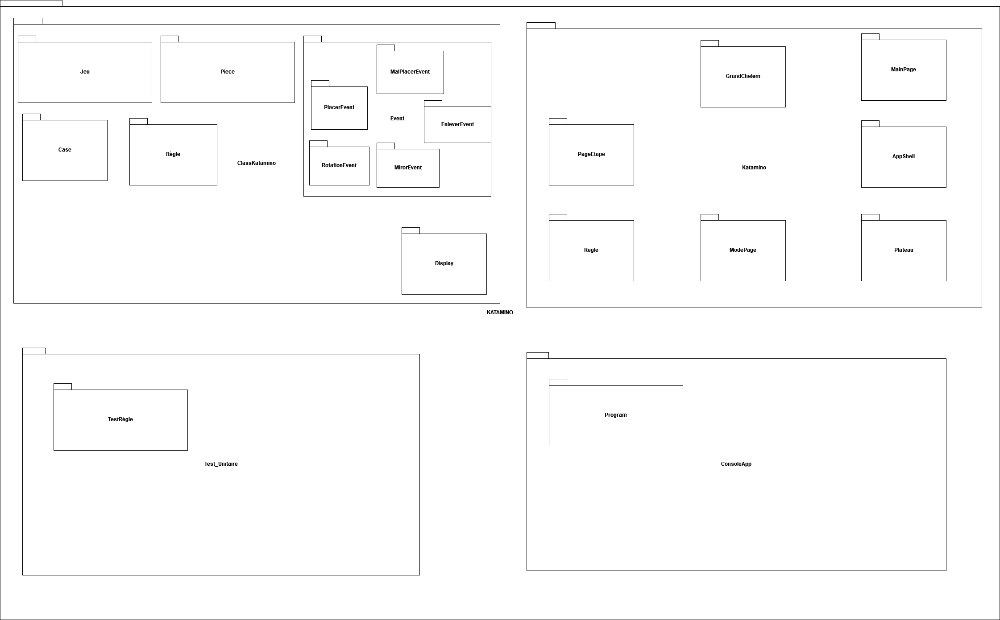

# Diagramme de paquetage

# Description du diagramme de paquetage

Le diagramme de paquetage de l'application katamino se divise en quatre dossier. Le dossier ClassKatamino, qui contient les classes de notre jeu, la classe jeu, la classe règle, la classe pièce et la classe case. Le dossier KATAMINO contient les vues du jeu. Le dossier Test_Unitaire contient nos tests unitaire. Enfin, le dossier ConsoleApp contient notre console de jeu.