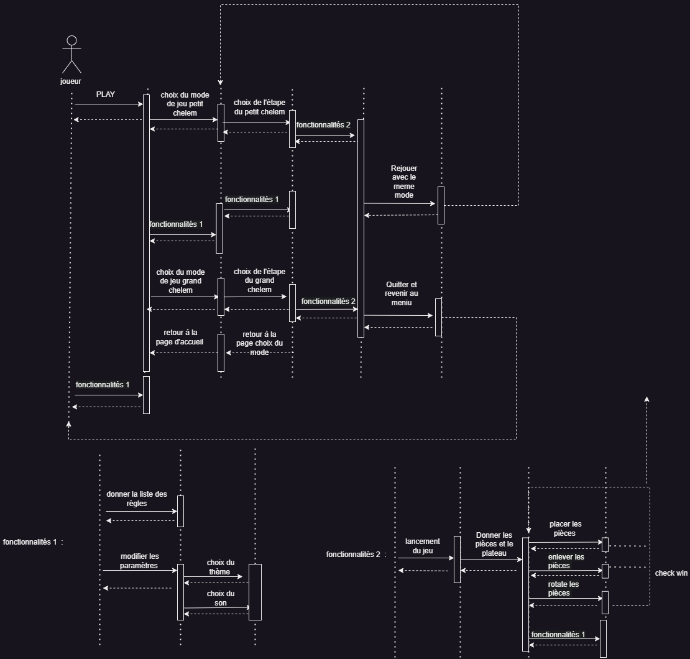

# Diagramme de séquence 

# Documentation du diagramme de séquence

### Principal

En partant du joueur, il est possible d'utiliser la fonctionnalité "PLAY" qui permet ensuite au joueur de choisir entre le mode de jeu "Petit Chelem" et le mode de jeu "Grand Chelem", ou alors de retourner en arrière grâce à un bouton. Ensuite, peu importe le choix du mode de jeu. Le joueur pourra choisir son étape du jeu, elles vont de A à G pour le Petit Chelem et de A à Z pour le Grand Chelem. Un bouton retour est aussi accessible pour revenir en arrière. Après cela, quoi qu'il arrive la fonctionnalité 2 se lance. Si le "check win" de la fonctionnalité 2 définis que le joueur a gagnés, alors deux choix s'offrent à lui. Soit il peut rejouer une partie du même mode de jeu qu'il vient de jouer et retourne sur le choix de l'étape, soit il peut retourner à l'accueil. 

### Fonctionalité 1

Cette fonctionnalité représente les paramètres de l'application. On peut soit changer ses paramètres soit aller lire les règles du jeu. Dans les paramètres, les actions possibles sont le changement du thème de l'application et l'activation ou la désactivation du son. Cette fonctionnalité est toujours accessible, à chaque étape.

### Fonctionalité 2

La fonctionnalité 2 représente le déroulement d'une partie. Le lancement du jeu engendre la distribution des pièces dont vous aurez besoin dans votre partie. Puis vous avez trois actions possibles pour continuer. Vous avez le choix de placer une pièce, d'enlever une pièce ou de changer la rotation de la pièce. Ensuite, le jeu regarde si la partie est terminée.  Si c'est le cas, alors il sort de la fonctionnalité 2. Sinon, il laisse le choix au joueur de rechoisir une action parmis les trois cité. Si c'est le cas, alors il sort de la fonctionnalité 2. Sinon, il laisse le choix au joueur de rechoisir une action parmi les trois cités.