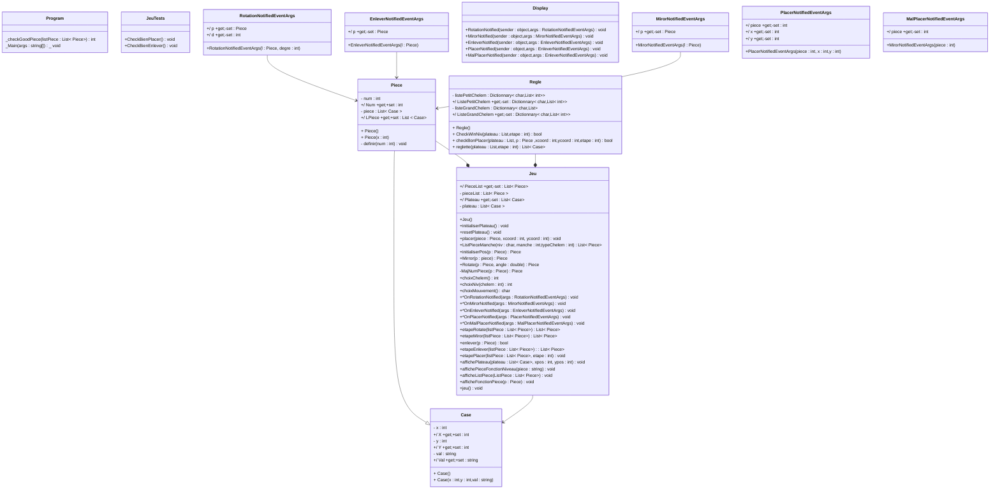

# Diagramme de Classe Katamino
#### -> les "_" devant une méthode signifie que la méthode est statique
#### -> les "*" devant une méthode signifie que la méthode est virtuelle
#### -> Petit problème : certains type de retour de méthodes ne veulent pas s'afficher alors qu'ils sont dans le code mermaid

## Description du diagramme de Classe
#### -> La class "program" est relié a toute les autres classes
#### -> Les évenements sont tous liès a jeu, mais il n'y a pas de flèches pour plus de lisibilité 

<table border="2">
  <tr>
    <th>Classe</th>
    <th>Description/méthodes</th>
    <th>liaison</th>
  </tr>
  <tr>
    <td>Case</td>
    <td>- 3 attributs avec x et y des entiers qui représentent les coordonnées d'une case et une chaine de caratère "valeur" car une case a une valeur. Ces 3 sont accessibles via 3 propriétés. - Cette classe n'a que des constructeurs comme méthodes </td>
    <td>Case est associé a jeu et a règle car ces 2 classes possèdent des cases.</td>
  </tr>
  <tr>
    <td>Piece</td>
    <td>- 2 attribut avec le numéro de la piece qui est un entier et la piece en elle-meme qui est un ensemble de case, accessible via des propriétés   - Ensuite au niveau des méthodes nous n'avons que des constructeurs et une méthodes qui défini les piece du jeu </td>
    <td>Hérite de case car une piece est un ensemble de case Compose le jeu car en dehors du jeu nos piece ne servent pas</td>
  </tr>
  <tr>
    <td>Jeu</td>
    <td>-2 attribut avec plateau qui est une liste de case et listPiece qui est une liste de piece, accesssible avec des propriétés. Cette classe mais en place toute les méthodes utiles au déroulé et fonctionnement du jeu, avec par exemple enlever, placer ou encore choixNiv</td>
    <td> Jeu posséde un evenement les événements</td>
  </tr>
  <tr>
    <td> Règle</td>
    <td>- 2 attributs qui sont des dictionnaires de caracteres et de list d'entier qui correspondent au 2 niveau de difficulté petit chelem et grand chelem, accessible en lecture seulement avec des propriétés.  - Ici nous avons le constructeur, la méthode qui met en place la reglette   - 2 méthodes qui vérifie le placement des pièces et si le niveau a été réussi avec CheckBonPlacer et checkWinNiv qui retourne toute les 2 un booléen </td>
    <td>Compose le jeu car en dehors les règles ne servent pas</td>
  </tr>
  <tr>
    <td>RotationNotifiedEventArgs</td>
    <td>- 2 propriétés qui representent une piece et son degré de rotation, avec le setteur privée.  Cette classe correspond a l'evènement de rotation d'une piece</td>
    <td>RotationNotifiedEventArgs possède une propriété de type Pièce</td>
  </tr>
  <tr>
    <td>MirorNotifiedEventArgs</td>
    <td>- 1 propriété qui represente une piece avec le setteur privée.  Cette classe correspond a l'evènement de rotation en miroir</td>
    <td>MirorNotifiedEventArgs possède une propriété de type Pièce</td>
  </tr>
  <tr>
    <td>EnleverNotifiedEventArgs</td>
    <td>- 1 propriété qui represente une piece avec le setteur privée.  Cette classe correspond a l'evènement d'enlever une pièce</td>
    <td>EnleverNotifiedEventArgs possède une propriété de type Pièce</td>
  </tr>
  <tr>
    <td>PlacerNotifiedEventArgs</td>
    <td>- 3 propriétés qui representent une piece son x et y, avec le setteur privée.  Cette classe correspond a l'evènement du placement d'une piece</td>
    <td>-</td>
  </tr>
  <tr>
    <td>MalPlacerNotifiedEventArgs</td>
    <td>- 3 propriétés qui representent une piece son x et y, avec le setteur privée.  Cette classe correspond a l'evènement du mauvais placement d'une piece</td>
    <td>-</td>
  </tr>
  <tr>
    <td>Display</td>
    <td>- Cette classe contient les méthodes d'évènements necessaire a l'affichage sur la console</td>
    <td></td>
  </tr>
  <tr>
    <td>Program</td>
    <td>- Cette classe contient la méthode static main qui contient elle-meme notre boucle de jeu, et est donc notre méthode qui lance l'application console.</td>
    <td></td>
  </tr>
  <tr>
    <td>JeuTests</td>
    <td>- Cette classe contient des méthodes qui testent plusieurs de nos fonction comme CheckBienEnlever.</td>
    <td></td>
  </tr>
</table>