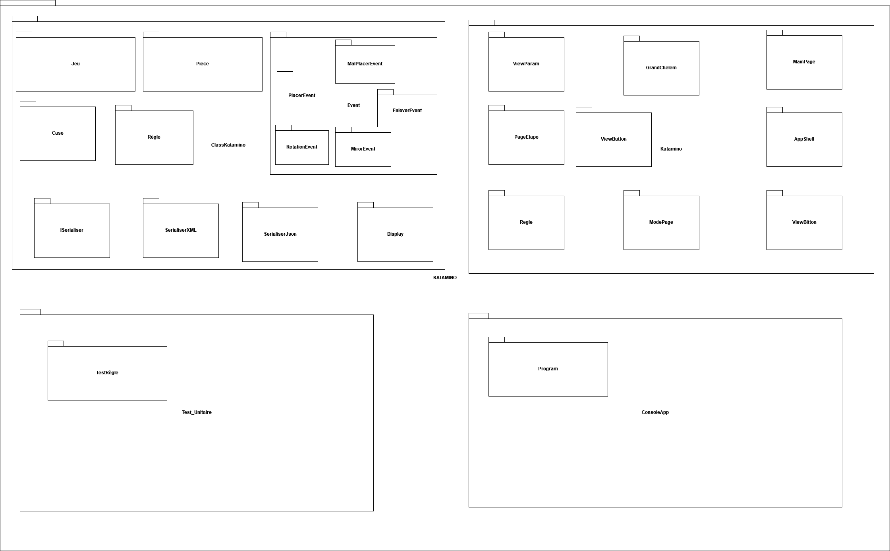

# Diagramme de paquetage

# Description du diagramme de paquetage avec la Persistance

### Le diagramme de paquetage de l'application katamino se divise en quatre dossier. Le dossier ClassKatamino, qui contient les classes de notre jeu, la classe jeu, la classe règle, la classe pièce et la classe case. Le dossier KATAMINO contient les vues du jeu. Le dossier Test_Unitaire contient nos tests unitaire. Enfin, le dossier ConsoleApp contient notre console de jeu.
### Pour la Persistance Nous avons donc a l'interieur de "ClasseKatamino" ajouter une interface qui implémente SerializeXML et SerializeJson afin de serialiser et deserialiser nos données de type jeu.