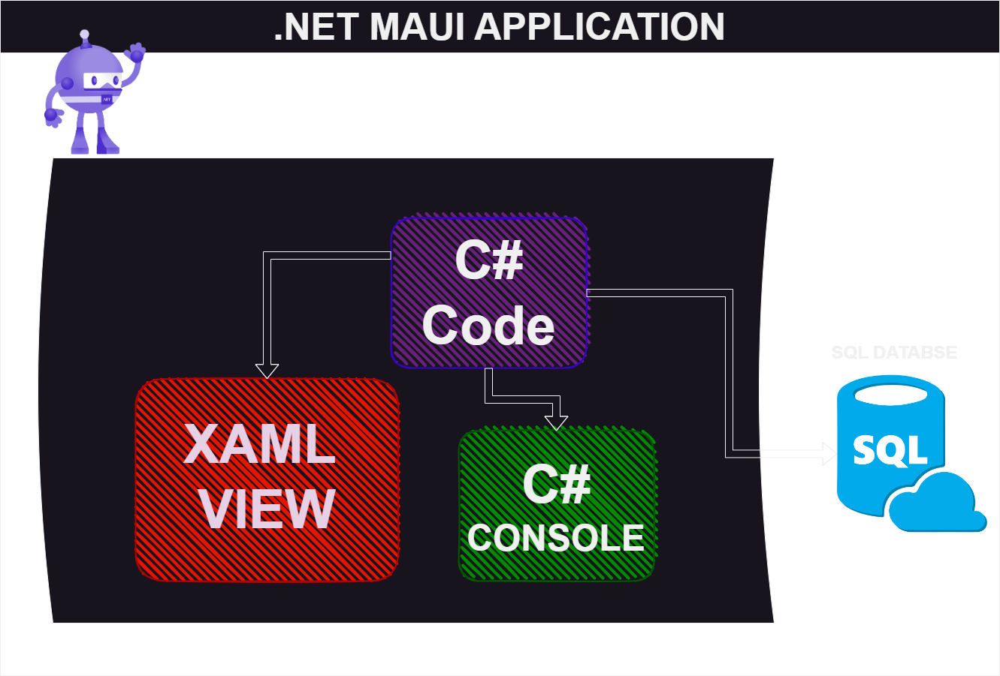

# Description d'architecture

* #### C# Code
  * Le code C# sera le cœur de notre application dans le sens où c'est grâce à lui que l'on va faire fonctionner notre machine. En effet, dans notre code, on peut y retrouver une boucle de jeu principale qui fait tourner différentes fonctions avec différents rôles, comme le fait de placer, enlever ou même tourner nos pièces. Par la suite, le code vérifie des conditions données par les règles. Ces conditions sont soit celles pour placer les pièces, soit les conditions de victoire. Mis bout à bout, ces fonctions permettent d'exécuter une partie sans interface visuelle.

* #### C# Console
  * La console C# ne sert pas à grand-chose si elle est toute seule. Or, en reliant notre code C# à des événements eux-mêmes reliés à de l'affichage textuel sur la console, on va pouvoir jouer à notre application grâce à la console.
  
* #### XAML Vues
  * Tout comme la console, les vues ne servent pas à grand-chose seules . Or, si on les relie aux événements intégrés à notre code C#, alors on va pouvoir assigner à nos boutons créés sur nos vues des actions comme bouger nos pièces, les placer, les enlever, etc. Les vues sont l'affichage de notre application et vont nous permettre de visualiser notre application comme si elle était distribuée sur les sites de téléchargement en ligne.

* #### SQL Database
  * La partie SQL Database va nous servir à enregistrer les données des joueurs en cours pour éviter les "rage-quits". Notre application va régulièrement envoyer les données du joueur à une base de données qui sera capable de les renvoyer instantanément à l'application MAUI pour pouvoir reprendre la partie là où elle en était.

* #### .NET MAUI APPLICATION
  * Ici, l'application .NET MAUI est le projet final que nous allons rendre, dans le sens où elle va relier à la fois la partie XAML (les vues) et la partie C# (le code) et la SQL ( database ) pour obtenir une application jouable par tous et prête à être déployée sur les différentes plateformes de téléchargement en ligne.
